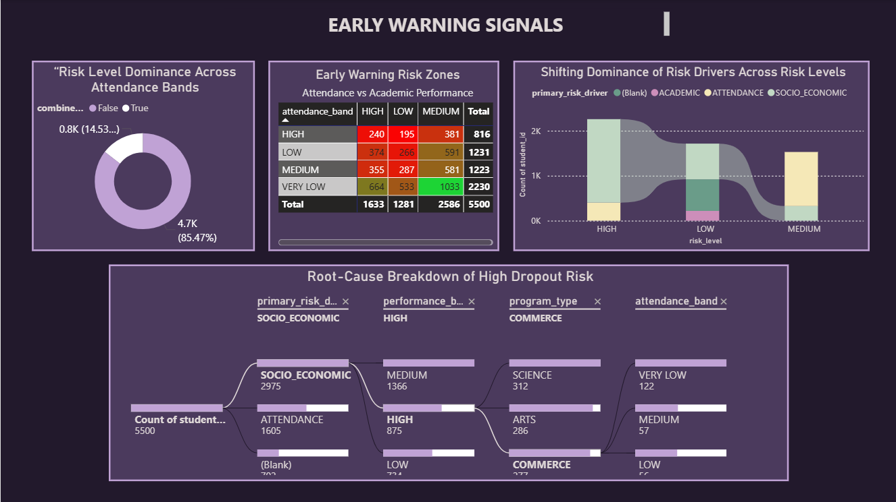

# 🎓 Student Dropout Risk & Education Retention Analytics System

An end-to-end analytics system designed to help educational institutions **understand student dropout risks early** and take **timely, data-driven actions** to improve retention.

---

## 🌟 Why This Project?

Educational institutions collect large volumes of student data, but:
- Data is spread across multiple systems  
- Analysis is often manual and delayed  
- Early warning signals are missed  

This project brings everything together into **one unified analytics solution** that transforms raw data into **clear insights, predictions, and alerts**.

---

## 🧠 What This System Does

- Helps **spot students who may need support early**
- Explains *why* a student is at risk (attendance, academics, or background)
- Reduces manual analysis through automation
- Supports better academic planning using dashboards and alerts

---

## 🏗️ System Architecture

📸 **PLACEHOLDER – End-to-End Architecture Diagram**

.png>)

---

## ⚙️ Technology Stack

| Area | Tools |
|-----|------|
| Data Processing | Python, Pandas |
| Big Data & Analytics | Databricks, PySpark |
| Storage | CSV, Delta Tables |
| Orchestration | Apache Airflow |
| Machine Learning | Logistic Regression |
| Alerts | Email Alerts, Databricks SQL Alerts |
| Visualization | Power BI |
| Version Control | GitHub |

---

## 📂 Datasets Used

Synthetic but realistic datasets (~5,000–6,000 records):

- Student Master Data  
- Academic Performance Records  
- Attendance Data  
- Socio-Economic Indicators  
- Retention & Dropout Status  

## 🥉🥈🥇 Data Architecture (Medallion Approach)

### 🥉 Bronze Layer – Raw Data
- Direct CSV ingestion using PySpark  
- Schema inference  
- Ingestion timestamp and source tracking  
- No transformations applied  

---

### 🥈 Silver Layer – Clean & Standardized Data
- Missing and inconsistent values handled  
- Grades, regions, and programs standardized  
- Attendance % and performance scores created  
- Updated timestamp added (ingestion time preserved)  

---

### 🥇 Gold Layer – Business-Ready Data
- Curated analytics-ready tables  
- Optimized for dashboards, ML, and alerts  

Key tables include:
- Student Risk Profile  
- Attendance vs Performance  
- Dropout Trends  
- Retention Overview  
- Intervention Candidates  

---

## 🤖 Machine Learning – Dropout Risk Prediction

- Logistic Regression used for prediction  
- Features engineered from Gold layer  
- Binary classification (at-risk vs not at-risk)  
- Model evaluated using AUC metric  

**AUC Score:** ~ **0.90**

---

### 📈 Databricks SQL Alerts – Institution Level
- Monitors overall dropout risk trends  
- Detects sudden increases in institutional risk  
- Designed for leadership and planning  

📸

---

## 🔁 Workflow Automation

- Apache Airflow orchestrates ETL pipelines  
- Triggers Databricks Jobs  
- Handles retries, scheduling, and monitoring  

---

## 📊 Power BI Dashboards

Dashboards provide:
- Executive overview  

- DROPOUT RISK ANALYSIS
 

- early_warning_signals

- Intervention planning  

---

## ✅ Results & Impact

- Helps identify students who may need support early  
- Enables focused and meaningful interventions  
- Reduces manual effort through automation  
- Improves visibility into retention challenges  
- Supports data-driven academic decisions  

---

## 🔮 Future Enhancements

- Real-time data ingestion  
- Advanced machine learning models  
- Automated intervention workflows  
- LMS system integration  
- Continuous model improvement using feedback loops  

---

## 🙌 Conclusion

This project demonstrates how data engineering, analytics, and machine learning can be combined to improve student retention.  
It turns raw data into insights that support **early action, better planning, and smarter decisions**.

---

## 📬 Contact

**Author:** Siddartha Samisetty  
📧 Email: samisettysiddartha2004@gmail.com  

